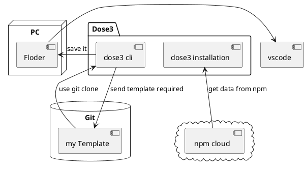

<h1 class="font-bold"> Welcome to DOSE3</h1>

## Best Starter kit for you

  
    Get strates <carbon:arrow-right class="inline"/>
  

  <button @click="$slidev.nav.openInEditor()" title="Open in Editor" class="text-xl slidev-icon-btn opacity-50 !border-none !hover:text-white">
    <carbon:edit />
  </button>
  <a href="https://github.com/donnie3237" target="_blank" alt="GitHub" title="Open in GitHub"
    class="text-xl slidev-icon-btn opacity-50 !border-none !hover:text-white">
    <carbon-logo-github />
  </a>

---
layout: image-right
image: >-
  https://img.freepik.com/free-vector/hand-painted-watercolor-pastel-sky-background_23-2148902771.jpg
---

# Table of content

<Toc maxDepth="1"></Toc>

---
transition: slide-left
---

# What is dose3

dose3 is best starter kit to make your project faster and basic standardof code
- 📝 **Template** - yeah we are template with cool framework
- 🎨 **Frommatter** - frommat your code easier with biomejs
- 🧑‍💻 **Dev fast** - make project fast for freelancer
- 🤹 **Easy to use** - dose3 is easy to use with clean documentation
- 📤 **Minimize** - use the lightweight and fast cli in your local storage
- 🛠 **Testing** - testing your app with vitest 

 
 

Read more about [dose3](https://dose3.dxse.site)

<!--
You can have `style` tag in markdown to override the style for the current page.
Learn more: https://sli.dev/guide/syntax#embedded-styles
-->

<!--
Here is another comment.
-->

---
transition: slide-up
---

# Framework and Lib

|     |     |
| --- | --- |
| ReactJS , SolidjS | for react deverloper base |
| VueJS | for vue deverloper |
| ExpressJS | basic api in javascript |
| Fastify | fast api in javascript code  |
| NextJS , Astro | for rendering framework |
| Actix-web | for blazingly fast and low cost api |
| Tauri | for native mobile app and desktop app |

---
transition: slide-left
---

# Integration

|     |     |
| --- | --- |
| Vitest | unit test framework for your web app |
| Biome | frommatter and lint in one lib |
| Prisma | ORM for your SQL database protect SQL injection |
| Mongoose | easy to manage your database and server  |
| Sqlx | ORM for rust lang  |
| Zustand | Global state in your client side |
| TailwindCSS | write your style in class propities |

---
class: px-20
---

# Document

the document make with astro starlightjs lets read the [docs](https://dose3.dxse.site/).

---
class: px-20
---
# How it work

---
layout: center
class: text-center
---

# Learn More

[Documentations](https://dose3.dxse.site) · [GitHub](https://github.com/slidevjs/slidev) 
